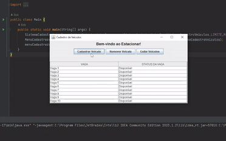

Estacionar
==========

O projeto Estacionar é um sistema de cadastro e gerenciamento de veículos em um estacionamento. Ele permite cadastrar,
remover e exibir informações sobre os veículos estacionados.

Funcionalidades
---------------

- Cadastro de veículos: permite cadastrar novos veículos informando a placa, ano e tipo de veículo.
- Remoção de veículos: possibilita remover um veículo do estacionamento informando a placa.
- Exibição de veículos cadastrados: exibe a lista de veículos atualmente estacionados.

Validações
----------

O aplicativo inclui validações para garantir a integridade dos dados inseridos pelos usuários. As seguintes validações
estão implementadas:

1. Validação de placa: a placa do veículo deve seguir o formato XXX-9999, onde "X" representa letras maiúsculas e "9"
   representa dígitos numéricos de 0 a 9. Caso a placa informada não esteja nesse formato, uma mensagem de erro será
   exibida.
2. Validação de ano: o ano do veículo deve ser um número de 4 dígitos entre 1900 e o ano atual. Se um ano inválido for
   fornecido, o sistema exibirá uma mensagem de erro.

Requisitos
----------

Para executar o projeto, você precisará ter instalado em sua máquina:

- Java Development Kit (JDK) versão 8 ou superior
- IDE de sua preferência (recomendado: IntelliJ IDEA, Eclipse)

Como executar o projeto
-----------------------

1. Clone o repositório do projeto em sua máquina local:

   `git clone https://github.com/seu-usuario/estacionar.git`

2. Abra o projeto em sua IDE.
3. Compile e execute a classe `Main` para iniciar o sistema.

Como usar o sistema
-------------------

Após executar o sistema, uma janela de interface será exibida. Você poderá interagir com o sistema através dos botões
disponíveis:

- Cadastrar Veículo: clique neste botão para cadastrar um novo veículo. Será solicitado informar a placa, ano e tipo de
  veículo.
    -
  
- Remover Veículo: clique neste botão para remover um veículo do estacionamento. Será solicitado informar a placa do
  veículo a ser removido.

  
- Exibir Veículos: clique neste botão para exibir a lista de veículos atualmente estacionados.

  

Limitações
----------

- O sistema possui um limite máximo veículos cadastrados. (No projeto tem um limite de 10 veiculos) Que caso você deseja
  alterar é modificar o LIMITE_MAXIMO_VEICULOS que está em atributo estático na classe SistemaCadastroVeiculos.
- A placa dos veículos deve seguir o formato XXX-9999, onde X é uma letra maiúscula e 9 é um dígito numérico.
- Não pode se ter placas iguais no sistema.

Contribuição
------------

Contribuições são sempre bem-vindas! Se você encontrou algum problema no projeto ou tem alguma sugestão de melhoria,
fique à
vontade para abrir uma issue ou enviar um pull request.

Licença
-------

Este projeto está licenciado sob a [MIT License](https://opensource.org/licenses/MIT).

----------------
Todos os direitos reservados. &copy; 2023 [Bob](https://github.com/esdrasspessoa). Todos os direitos reservados.